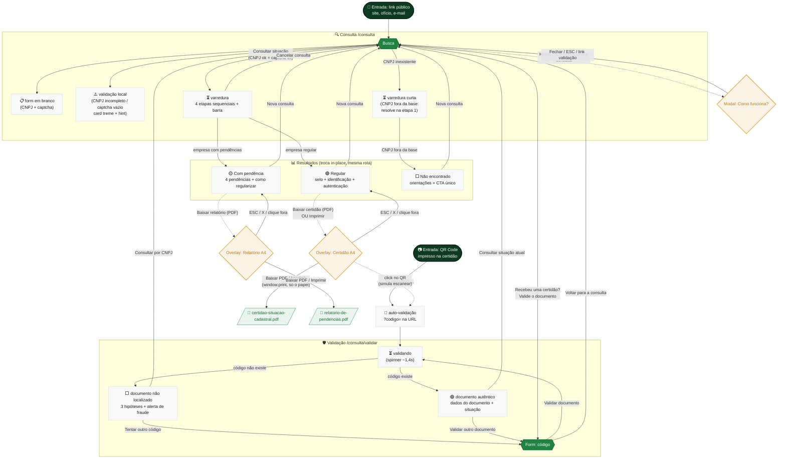

# Consulta de Regularidade por CNPJ — Mapa de Fluxos e Estados

Documento de referência para handoff com o time de desenvolvimento e guia visual durante a implementação.

Cobre todos os caminhos possíveis do usuário nas **páginas públicas de consulta** (`/consulta` e `/consulta/validar`), que ficam **fora do sistema autenticado**: qualquer pessoa com o link consulta a situação de uma empresa perante o Recicla Goiás (Decreto estadual nº 10.255/2023) e valida a autenticidade de documentos emitidos.

O protótipo navegável está implementado em Vue 3 neste repositório (branch `feat/consulta-regularidade`, [PR #21](https://github.com/brunomarques-ux/reciclagoias/pull/21)). **O código é a especificação viva**: layout, copy, tokens e animações estão prontos; o trabalho do dev é trocar o mock por backend real preservando os comportamentos mapeados aqui. As telas de referência visual estão no Figma, arquivo "SisRev - Rascunho", página "🟢 Telas - 2026", seção **Julho/26**.

> 📌 Atualizar este documento sempre que uma nova rota, estado ou overlay for adicionado. Atualizar também o frontmatter (`ultima_revisao`).

---

## 1. Diagrama de fluxo

Visualização completa das rotas, estados e transições. O GitHub renderiza Mermaid nativamente — basta abrir este arquivo no repo.

### Legenda

| Símbolo | Significado |
|---|---|
| 🟢 retângulo verde | Rota (URL real) |
| ⬜ retângulo cinza | Estado de uma rota (troca in-place, sem mudar URL) |
| 🟡 losango âmbar | Modal / overlay |
| 📄 paralelogramo | Documento PDF gerado |
| → linha sólida | Navegação direta |
| -.-> linha pontilhada | Abre modal/overlay ou ação fora da navegação |

---

## 2. Inventário de estados por tela

### 2.1 Busca — `/consulta`

| Estado | Quando ocorre | UI mostrada | Componente fonte |
|---|---|---|---|
| **Form em branco** | Entrada na rota | Pill "CONSULTA PÚBLICA", título com accent verde, card 560px: label + input CNPJ com máscara progressiva `00.000.000/0000-00` + captcha mock + CTA "Consultar situação". Abaixo: linha de confiança (escudo), pill-link "Recebeu uma certidão? Valide o documento" e link de autodeclaração | `components/consulta/ConsultaBusca.vue` |
| **CNPJ incompleto no submit** | `onlyDigits(cnpj).length < 14` | Card treme (shake 0.4s) + hint vermelho "Digite o CNPJ completo (14 dígitos)." | `ConsultaBusca.vue` |
| **Captcha não marcado no submit** | `captchaState !== 'done'` | Card treme + hint "Confirme que você não é um robô." | `ConsultaBusca.vue` |
| **Captcha verificando** | Click no box "Não sou um robô" | Checkbox vira spinner por ~900ms | `ConsultaBusca.vue` |
| **Captcha ok** | Após o delay | Check verde com pop (scale 0.7→1.12→1) | `ConsultaBusca.vue` |
| **Máscara em digitação** | A cada input | Pontos/barra/hífen aplicados progressivamente; só dígitos aceitos; limite 14 | `maskCnpj()` em `data/mocks/consulta.ts` |

### 2.2 Varredura — estado in-place de `/consulta`

| Estado | Quando ocorre | UI mostrada | Componente fonte |
|---|---|---|---|
| **Varredura completa** | CNPJ existe na base | Pill "VERIFICANDO" (dot pulsando), anel com lupa + arco girando (1.1s/volta), título, subtítulo, **barra de progresso em degraus** (12→34→62→86→100%), chip com o CNPJ digitado, 4 etapas que acendem em sequência (~850ms cada): pending (cinza) → active (fundo verde-claro + mini spinner) → done (bolinha verde + check com pop). Botão outline full-width "✕ Cancelar consulta" | `components/consulta/ConsultaVarredura.vue` |
| **Varredura curta (honesta)** | CNPJ **não** existe na base | Etapa 1 conclui e resolve direto pro "Não encontrado" (~2,2s total). Não finge conferir metas de quem não está na base. Barra para em 46% | `ConsultaVarredura.vue` |
| **Fim da varredura** | Última etapa done | Anel vira círculo verde cheio com check (pop 0.35s), barra completa 100%, swap pro resultado ~550ms depois | `ConsultaVarredura.vue` |
| **Cancelar** | Click no botão durante a varredura | Volta pro form de busca (timers limpos no unmount) | `ConsultaVarredura.vue` |
| **Reduced motion** | `prefers-reduced-motion: reduce` | Sem giro/pulso; etapas saltam em degraus rápidos (~350ms); barra sem transition | `ConsultaVarredura.vue` |
| **Acessibilidade** | Sempre | Card com `role="status"` + `aria-live="polite"` + `aria-busy`; progresso agregado num span visualmente oculto ("Etapa X de 4") pra não spammar o leitor de tela | `ConsultaVarredura.vue` |

### 2.3 Resultado · Regular — estado in-place de `/consulta`

| Estado | Quando ocorre | UI mostrada | Componente fonte |
|---|---|---|---|
| **Resultado regular** | `empresa.status === 'regular'` | Card 640px com borda verde: selo circular verde com halo (pop), badge chip "SITUAÇÃO REGULAR", título 28px "Empresa regular no **Recicla Goiás**" (accent verde), subtítulo citando o decreto, bloco identificação (razão social / CNPJ / município), bloco autenticação (código + QR 72px), CTAs: **Baixar certidão (PDF)** (primário) · Imprimir (outline) · Nova consulta (ghost), microdisclaimer legal | `components/consulta/ConsultaResultRegular.vue` |
| **Entrada em cascata** | Ao montar | Blocos entram com fade-up escalonado (badge 80ms → título 140ms → ... → disclaimer 540ms) via classe `.cx-in` + `--d` | `ConsultaResultRegular.vue` |
| **Baixar certidão / Imprimir** | Click em qualquer um dos dois | Abre o overlay da certidão A4 (variante regular) | emite pra `pages/ConsultaPage.vue` |

### 2.4 Resultado · Com pendência — estado in-place de `/consulta`

| Estado | Quando ocorre | UI mostrada | Componente fonte |
|---|---|---|---|
| **Resultado com pendência** | `empresa.status === 'pendencia'` | Card 640px com borda âmbar: selo âmbar (alert), badge sólido âmbar "COM PENDÊNCIA", título 2 linhas com accent, linha de data da consulta, identificação (+ perfil no sistema), lista **"Pendências identificadas"** com chip contador ("4 pendências"), bloco "Como regularizar" com link sublinhado pra Autodeclaração, aviso legal sóbrio (Lei 9.605/1998 + Decreto 6.514/2008), CTAs: **Regularizar situação →** · Baixar relatório (PDF) · Nova consulta | `components/consulta/ConsultaResultPendencia.vue` |
| **Item de pendência** | Cada item da lista | Card com borda âmbar-clara: ícone em chip âmbar 36px + título + descrição + caixa tint com "**Como resolver:** ..." | `ConsultaResultPendencia.vue` |
| **Cascata das pendências** | Ao montar | Blocos de topo em fade-up (80→400ms); itens da lista entram em sequência (90ms entre cada, base 480ms) | `ConsultaResultPendencia.vue` |
| **Âmbar local** | Sempre | A paleta âmbar é LOCAL da tela (`--cx-amber-*`: #FBF4E6 / #F5E6C8 / #E0A63B / #B8791B / #F0E4CC), **não** usa `--rg-primitive-amber-*` do DS (saturado demais pra página). Nunca vermelho: pendência é orientativa, não punição | `ConsultaResultPendencia.vue` |

### 2.5 Resultado · Não encontrado — estado in-place de `/consulta`

| Estado | Quando ocorre | UI mostrada | Componente fonte |
|---|---|---|---|
| **Não encontrado** | CNPJ fora da base | Card 640px com borda neutra: selo cinza (lupa cortada), badge neutro "NÃO ENCONTRADO", título 2 linhas com accent, subtítulo com as hipóteses, chip ecoando o CNPJ consultado, bloco "O que você pode fazer" com 3 orientações e links sublinhados ("Veja como começar", "Autodeclaração de Não Enquadramento"), **CTA único** primário full-width "Nova consulta" | `components/consulta/ConsultaResultNaoEncontrado.vue` |
| **Tom** | Sempre | Neutro/calmo (cinza slate), não é tela de erro. Sem "baixar PDF": não encontrado **não gera documento** | `ConsultaResultNaoEncontrado.vue` |

### 2.6 Certidão / Relatório A4 — overlay sobre `/consulta`

| Estado | Quando ocorre | UI mostrada | Componente fonte |
|---|---|---|---|
| **Overlay aberto** | CTA de download/imprimir num resultado | Backdrop verde-escuro translúcido (fade 240ms), barra de ações no topo (Baixar PDF · Imprimir · X), papel A4 (820px, fade-up) com scroll interno | `components/consulta/ConsultaCertidao.vue` |
| **Variante regular** | `tipo === 'certidao-regular'` | Título "CERTIFICADO DE SITUAÇÃO CADASTRAL", badge verde, seção "O que esta certidão atesta" (parágrafo) | `ConsultaCertidao.vue` |
| **Variante pendências** | `tipo === 'relatorio-pendencias'` | Título "RELATÓRIO DE PENDÊNCIAS", badge âmbar "SITUAÇÃO COM PENDÊNCIA", seção "Pendências identificadas" (lista com ícones âmbar) + nota "caráter meramente informativo" | `ConsultaCertidao.vue` |
| **Estrutura do papel** | Sempre | Cabeçalho institucional (brasão placeholder + ESTADO DE GOIÁS + logo Recicla + fio verde 3px), título, badge de situação, identificação (grid 2 col), atesto/pendências, base legal (bullets), referência/validade (card tint 3 colunas), rodapé de autenticação (código mono + QR 96px + URL de validação) | `ConsultaCertidao.vue` |
| **Imprimir / Baixar PDF** | Click | `window.print()`. O `@media print` esconde o app e imprime **só o papel**: `@page A4 margin 0` + `zoom 0.82` → documento cabe em **1 página** | `ConsultaCertidao.vue` (style global) |
| **QR clicável (protótipo)** | Click no QR do rodapé | Navega pra `/consulta/validar?codigo=<código>` simulando o escaneamento pela câmera | `ConsultaCertidao.vue` |
| **Fechar** | ESC, botão X ou clique no backdrop | Fade-out 240ms (componente fica montado, prop `open` controla) | `ConsultaCertidao.vue` |

### 2.7 Validação de documento — `/consulta/validar`

| Estado | Quando ocorre | UI mostrada | Componente fonte |
|---|---|---|---|
| **Form** | Entrada sem `?codigo=` | Pill "VALIDAÇÃO DE DOCUMENTO", título "Confira se uma certidão é **autêntica**", card 560px: input de código (uppercase automático) + **captcha "Não sou um robô"** (mesmo componente da busca) + CTA "Validar documento". Linha sobre o QR + link de volta pra consulta | `pages/ConsultaValidarPage.vue` |
| **Chegada pelo QR/certidão** | `?codigo=` na URL | Campo de código vem **pré-preenchido** + nota "Código preenchido pelo documento. Confirme que você não é um robô e valide". A checagem NÃO roda sozinha: exige captcha + clique (barreira anti-robô, mesma da busca) | `ConsultaValidarPage.vue` |
| **Código curto no submit** | `< 6` caracteres úteis | Hint vermelho "Informe o código completo impresso no documento." | `ConsultaValidarPage.vue` |
| **Captcha não marcado no submit** | `captchaOk === false` | Hint "Confirme que você não é um robô." | `ConsultaValidarPage.vue` |
| **Validando** | Submit ok (código + captcha) | Pill "VALIDANDO" (dot pulsa), card com anel girando + "Conferindo o documento" + eco do código (~1,4s; 300ms com reduced-motion) | `ConsultaValidarPage.vue` |
| **Documento autêntico** | Código existe na base | Selo verde (check-decagram), badge "DOCUMENTO AUTÊNTICO", título com accent, bloco "Dados do documento" (tipo, código, razão social, CNPJ, **situação na emissão** com chip verde/âmbar, data da validação), nota "a situação pode ter mudado", CTAs: Consultar situação atual · Validar outro documento | `ConsultaValidarPage.vue` |
| **Documento não localizado** | Código não existe | Selo cinza (file-question), badge neutro, eco do código digitado, bloco "O que isso pode significar" (erro de digitação / documento alterado / **não emitido pelo sistema: desconfie**), CTAs: Tentar outro código · Consultar por CNPJ | `ConsultaValidarPage.vue` |

### 2.8 Chrome compartilhado (todas as telas)

| Elemento | Comportamento | Componente fonte |
|---|---|---|
| **Header** | Barra verde-escura 76px (`--rg-primitive-brand-950`): logo branca à esquerda (link pra home `/`), botão verde "Como funciona a consulta" à direita (abre modal). Sem faixa de governo, sem rodapé | `components/consulta/ConsultaShell.vue` |
| **Logo branca** | `public/brand/recicla-logo-horizontal-branco.svg`: cópia do SVG oficial com regra CSS `#Camada_2 .st2 { fill: #fff }` (texto branco, folha colorida preservada) | asset |
| **Hero** | Fundo soft-tint (`--rg-color-surface-soft-tint`), conteúdo centralizado, `min-height: 100vh` no shell | `ConsultaShell.vue` |
| **Troca in-place** | `<Transition name="cx-swap" mode="out-in">`: leave 180ms accelerate (fade + sobe 8px), enter 280ms emphasized (fade + sobe de 16px) | `pages/ConsultaPage.vue` e `ConsultaValidarPage.vue` |

---

## 3. Catálogo de modais e overlays

| Modal/Overlay | Quando abre | Conteúdo | Como fecha |
|---|---|---|---|
| **Como funciona a consulta** | Botão do header (qualquer tela do módulo) | Título + 3 passos numerados (digite o CNPJ → sistema varre a base → recebe a situação) + nota com link pra validação de documentos | X, ESC ou clique no backdrop |
| **Certidão A4 (regular)** | "Baixar certidão (PDF)" ou "Imprimir" no resultado Regular | Documento completo (ver §2.6) + barra Baixar PDF / Imprimir | X, ESC ou backdrop (fade-out) |
| **Relatório A4 (pendências)** | "Baixar relatório (PDF)" no resultado Com pendência | Variante âmbar do documento | idem |

### Microcopy de feedback

| Situação | Mensagem | Onde |
|---|---|---|
| CNPJ incompleto | "Digite o CNPJ completo (14 dígitos)." | hint no card de busca (`role="alert"`) |
| Captcha vazio | "Confirme que você não é um robô." | hint no card de busca |
| Código curto | "Informe o código completo impresso no documento." | hint no card de validação |
| Confiança (busca) | "Consulta gratuita e oficial. Nenhum dado é armazenado." | abaixo do card |
| Orientativa (varredura) | "Consulta orientativa, sem valor de certidão até a emissão do certificado."¹ | — |
| Disclaimer (regular) | "Consulta de caráter informativo... Não substitui a certidão oficial nem as comprovações exigidas pela SEMAD..." | rodapé do card |
| Aviso legal (pendência) | "Consulta orientativa. O descumprimento... penalidades da Lei federal nº 9.605/1998 e do Decreto federal nº 6.514/2008. Situação oficial e prazos são definidos pelo comitê gestor." | rodapé do card |
| Disclaimer (não encontrado) | "Consulta orientativa. A ausência de registro não substitui a análise oficial do comitê gestor." | rodapé do card |
| Alerta de fraude (validação) | "O documento pode não ter sido emitido pelo Recicla Goiás. Nesse caso, desconfie e não o aceite como comprovação." | bloco de hipóteses |

¹ Presente na spec da varredura; no protótipo atual a varredura mostra só a barra (edição de design de 07/2026). Manter fora a menos que o produto peça de volta.

---

## 4. Decisões de UI baseadas em dados

Condicionais que o front precisa preservar quando substituir o mock por backend real. **Hoje tudo vive em `src/data/mocks/consulta.ts`** — o nome ao lado é a função real.

### 4.1 Consulta por CNPJ

| Regra | Helper | Resultado | Onde é usada |
|---|---|---|---|
| **Busca por CNPJ** | `findEmpresaByCnpj(cnpj)` | `ConsultaEmpresa \| null` (null = não encontrado). Compara só dígitos, aceita qualquer formatação | `ConsultaPage.iniciarConsulta()` |
| **Máscara progressiva** | `maskCnpj(value)` | Aplica `00.000.000/0000-00` conforme digita; corta em 14 dígitos | input da busca |
| **Só dígitos** | `onlyDigits(value)` | Remove tudo que não é número | validação e comparação |
| **Estado do resultado** | `empresa?.status ?? 'nao-encontrado'` | `'regular' \| 'pendencia' \| 'nao-encontrado'` | `ConsultaPage.resultado` (computed) |

> 📌 **No backend real:** a consulta deve resolver ANTES da varredura terminar (a varredura é encenação do tempo de resposta). Se a API responder rápido, a animação segura o ritmo; se demorar mais que o ciclo, a etapa 4 fica em active-loop até resolver (**a barra nunca chega a 100% antes da resposta**, pra não prometer resultado que ainda não veio).

### 4.2 Timing da varredura

| Cenário | Comportamento | Duração alvo |
|---|---|---|
| **Empresa na base** | 4 etapas encadeadas (~850ms cada) + resolução | ~3,9s |
| **CNPJ fora da base** | Etapa 1 conclui → resolve direto (curta e honesta; não finge conferir metas) | ~2,2s |
| **Reduced motion** | Etapas saltam a ~350ms, sem giro/pulso, barra sem transition | ~1,5s |
| **Cancelar** | Limpa todos os timers (`onBeforeUnmount`) e volta pra busca | imediato |

### 4.3 Validação de documento

| Regra | Helper | Resultado | Onde é usada |
|---|---|---|---|
| **Busca por código** | `findCertidaoByCodigo(codigo)` | `CertidaoInfo \| null` — inclui `tipo` (`certidao-regular` / `relatorio-pendencias`) e a empresa | `ConsultaValidarPage.validar()` |
| **Normalização** | `normalizeCodigo(value)` | Caixa alta + remove espaços | input e comparação |
| **Deep-link do QR** | `route.query.codigo` no `onMounted` | Auto-valida sem passar pelo form; flag `viaQr` muda o subtítulo | `ConsultaValidarPage.vue` |
| **Coerência código ↔ PDF** | — | O código e o QR exibidos na tela de resultado DEVEM ser os mesmos do PDF baixado, senão a validação falha e derruba a credibilidade | contrato com o backend |

### 4.4 Documentos (PDF)

| Regra | Comportamento |
|---|---|
| **Geração no protótipo** | `window.print()` + `@media print` que esconde `#app` e imprime só o papel (`@page A4 margin 0`, `zoom 0.82` → 1 página). No produto real recomenda-se PDF **server-side** (texto real, pesquisável, código+QR autoritativos), mantendo o print CSS como fallback |
| **Quem gera o quê** | Regular → Certificado de Situação Cadastral. Com pendência → Relatório de Pendências. **Não encontrado → nada** (não existe documento de quem não está na base) |
| **QR Code** | No protótipo é ícone decorativo + link. No real: QR gerado a partir da URL `https://<dominio>/consulta/validar?codigo=<código>` |
| **Datas dinâmicas** | "Consulta realizada em", "Data de referência" e "Emitido em" usam `Intl.DateTimeFormat('pt-BR')` do momento da consulta — no real vêm do backend |
| **Validades** | Tela de consulta não exibe validade (edição de design 07/2026); certidão A4 exibe "90 dias da emissão". Valor proposto, **pendente de validação jurídica** |

### 4.5 Captcha e proteção anti-abuso (recomendação de UX + segurança)

O captcha das duas telas públicas (`/consulta` e `/consulta/validar`) é **mock visual** (click → spinner 900ms → check verde), reaproveitado do componente `components/consulta/ConsultaCaptcha.vue`. O submit já bloqueia sem o captcha marcado — preservar esse gate.

**O que recomendamos pro produto real (padrão de mercado pra formulários públicos sem login):**

1. **Captcha de provedor** no lugar do mock, verificado **server-side** (nunca confiar só no cliente). Opções, da mais leve pra mais robusta:
   - **Cloudflare Turnstile** — sem desafio visual na maioria dos casos, gratuito, boa UX (recomendado como default).
   - **hCaptcha** — foco em privacidade, plano gratuito.
   - **Google reCAPTCHA v3** — score invisível; exige tratar o score no backend.
   O fluxo: o front gera um token, envia junto da requisição, e o endpoint valida o token com o provedor antes de responder.

2. **Rate limiting** no backend, independente do captcha (o captcha barra robô casual; o rate limit barra abuso automatizado e enumeração de CNPJ/código):
   - Limite por IP (ex.: 5–10 req/min por rota) com resposta `429 Too Many Requests`.
   - Limite mais estrito na **validação de código** (é um endpoint de verificação: alguém poderia varrer códigos por força bruta). Considerar backoff progressivo após N tentativas inválidas.
   - Opcional: cache curto por CNPJ pra não repetir consulta idêntica.

3. **Aplicar nas DUAS rotas.** A validação de documento também recebe captcha: ao chegar pelo QR/certidão (`?codigo=`), o campo vem **preenchido**, mas a checagem só roda depois do captcha + clique em validar. Isso evita que um QR compartilhado vire um endpoint de verificação em massa.

4. **Higiene extra**: honeypot invisível no form, e no endpoint de validação responder em tempo constante (não vazar, pelo tempo de resposta, se o código existe ou não).

### 4.6 Conteúdo legal (validar com jurídico/SEMAD antes de publicar)

| Item | Valor atual | Status |
|---|---|---|
| Nome do documento | "Certificado de Situação Cadastral — Logística Reversa de Embalagens em Geral" | Conforme brief |
| Emissor | "Emitido pela entidade gestora do sistema coletivo" (a SEMAD registra, não emite) | Conforme decreto (art. 11) |
| Validade da certidão | 90 dias | Proposta, validar |
| Texto do atesto / caráter declaratório | Ver §2.6 | Proposta, validar |
| Sanções citadas | Lei federal nº 9.605/1998 + Decreto federal nº 6.514/2008 (só em microtexto, tom sóbrio) | Igual ao restante do site |
| Prazo do relatório anual | 31 de março | Conforme decreto |
| URL de validação impressa | `reciclagoias.go.gov.br/consulta/validar` | Placeholder, confirmar domínio |
| Brasão de Goiás | Placeholder cinza "BRASÃO" | Aguardando arquivo oficial |

### 4.7 Dados mocados (a base fake)

Definidos em `src/data/mocks/consulta.ts`:

| Entrada | Resultado | Detalhes |
|---|---|---|
| CNPJ `12.345.678/0001-90` | 🟢 **Regular** | EMBALAGENS GOIÁS INDÚSTRIA E COMÉRCIO LTDA · Goiânia/GO · código `RG-2026-4F8A-2C7B-90D1` |
| CNPJ `98.765.432/0001-10` | 🟡 **Com pendência** | EMBALAGENS CERRADO INDÚSTRIA E COMÉRCIO LTDA · Anápolis/GO · 4 pendências · código `RG-2026-9B12-7E44-AA03` |
| Qualquer outro CNPJ (14 dígitos) | ⬜ **Não encontrado** | — |
| Código `RG-2026-4F8A-2C7B-90D1` | 🟢 Documento autêntico | Certificado de Situação Cadastral (regular) |
| Código `RG-2026-9B12-7E44-AA03` | 🟡 Documento autêntico | Relatório de Pendências (situação com pendência na emissão) |
| Qualquer outro código | ⬜ Não localizado | — |

### 4.8 Deep-links de demonstração (`?demo=`)

Atalhos pra abrir qualquer estado sem passar pelo fluxo — úteis pra QA, demonstração e captura de tela. **Remover ou proteger por env no produto final.**

| URL | Abre |
|---|---|
| `/consulta?demo=regular` | Resultado regular |
| `/consulta?demo=pendencia` | Resultado com pendência |
| `/consulta?demo=nao-encontrado` | Resultado não encontrado |
| `/consulta?demo=varredura` | Varredura congelada na etapa 2 |
| `/consulta?demo=certidao-regular` | Resultado regular + overlay da certidão aberto |
| `/consulta?demo=certidao-pendencias` | Resultado pendência + overlay do relatório aberto |
| `/consulta/validar?codigo=RG-2026-4F8A-2C7B-90D1` | Validação automática (autêntico) |
| `/consulta/validar?codigo=QUALQUER-COISA` | Validação automática (não localizado) |

### 4.9 Integrações a construir (mock → real)

| # | Integração | Substitui | Contrato sugerido |
|---|---|---|---|
| 1 | `GET /api/consulta?cnpj=` | `findEmpresaByCnpj` | `{ status: 'regular'\|'pendencia'\|'nao-encontrado', empresa?: {...}, pendencias?: [...], codigoAutenticacao?, consultadaEm }` |
| 2 | `GET /api/validacao?codigo=` | `findCertidaoByCodigo` | `{ valido: boolean, tipo?, empresa?, emitidaEm?, situacaoNaEmissao? }` |
| 3 | Verificação de captcha | mock visual | token do provider no header/body da consulta |
| 4 | `GET /api/certidao/:codigo.pdf` | `window.print()` | PDF server-side com QR real |

---

## 5. Checklist de cobertura para o dev

### Busca
- [ ] Máscara progressiva de CNPJ (digitar, colar, apagar)
- [ ] Submit bloqueado com CNPJ incompleto (shake + hint)
- [ ] Submit bloqueado sem captcha (shake + hint)
- [ ] Captcha: click → spinner → check com pop
- [ ] Pill-link pra validação de documento visível
- [ ] Link de autodeclaração aponta pra `/#enquadramento`
- [ ] Modal "Como funciona" abre/fecha (X, ESC, backdrop)

### Varredura
- [ ] 4 etapas acendem em sequência com os 3 estados visuais (pending/active/done)
- [ ] Barra de progresso em degraus sincronizados; nunca 100% antes da resposta
- [ ] Anel gira e vira check verde no fim
- [ ] CNPJ fora da base → varredura curta (resolve na etapa 1)
- [ ] Cancelar volta pra busca sem vazar timers
- [ ] `aria-live` agregado (Etapa X de 4), `aria-busy`
- [ ] `prefers-reduced-motion`: degraus secos, sem giro/pulso

### Resultados (os 3)
- [ ] Regular: selo pop + cascata de blocos + identificação + código/QR
- [ ] Pendência: badge sólido âmbar, contador dinâmico, itens em cascata, "Como resolver" em caixa tint
- [ ] Pendência: âmbar local (nunca o amber saturado do DS, nunca vermelho)
- [ ] Não encontrado: chip com CNPJ ecoado, links sublinhados, CTA único, SEM baixar PDF
- [ ] "Nova consulta" reseta o fluxo nos 3
- [ ] Mobile: CTAs empilham SEM esmagar altura (`flex: none` na coluna — bug corrigido em 06/07)
- [ ] Cascatas respeitam reduced-motion

### Certidão / Relatório A4
- [ ] Overlay abre com fade + papel com fade-up; fecha com fade (ESC, X, backdrop)
- [ ] Variante regular vs pendências (título, badge, seção central)
- [ ] Imprimir/Baixar imprime SÓ o papel, em 1 página A4
- [ ] QR leva pra validação com o código correto
- [ ] Código na tela = código no documento

### Validação
- [ ] Form valida código curto
- [ ] Uppercase automático no input
- [ ] Loading ~1,4s com eco do código
- [ ] Autêntico: dados completos + chip de situação na emissão (verde/âmbar)
- [ ] Autêntico via QR: subtítulo específico
- [ ] Não localizado: 3 hipóteses + alerta de fraude
- [ ] "Validar outro documento" limpa `?codigo=` da URL
- [ ] Deep-link `?codigo=` auto-valida ao carregar

### Geral
- [ ] Header idêntico nas 2 rotas; logo volta pra home
- [ ] Troca in-place com cx-swap (leave 180ms / enter 280ms)
- [ ] Todas as animações desligam com `prefers-reduced-motion`
- [ ] Viewports: 375 / 640 / 768 / 1024 / 1440
- [ ] Captcha real server-side antes de ir pro ar
- [ ] Deep-links `?demo=` removidos ou protegidos por env

---

## Apêndice — referência rápida de rotas

| Rota | Componente | Acesso |
|---|---|---|
| `/consulta` | `pages/ConsultaPage.vue` | Público, sem login |
| `/consulta/validar` | `pages/ConsultaValidarPage.vue` | Público, sem login (aceita `?codigo=`) |

Definições em `src/router/index.ts`. Componentes do módulo em `src/components/consulta/`. Mock em `src/data/mocks/consulta.ts`.

**Tokens:** design system em `src/design-system/tokens/*.css` (ver `HANDOFF-DESENVOLVIMENTO.md` §tokens). O módulo usa Inter, verde brand (`--rg-primitive-brand-*`), soft-tint e o âmbar local descrito em §2.4.

---

## Histórico de decisões

| Data | Decisão | Status | Motivo |
|---|---|---|---|
| 2026-07-01 | Busca por CNPJ + captcha (sem login) | **Vigente** | Página pública estilo Receita/SEFAZ; anti-robô obrigatório |
| 2026-07-01 | 3 estados de resultado (Regular · Com pendência · Não encontrado), troca in-place | **Vigente** | Mesmo padrão de swap dos Prêmios da landing |
| 2026-07-01 | Certidão = prévia na tela + download PDF A4 | **Vigente** | — |
| 2026-07-06 | Todo documento tem código de autenticação + QR; tela pública de validação (`/consulta/validar`) com deep-link | **Vigente** | Ciclo de autenticidade: quem recebe o papel confere se é verdadeiro |
| 2026-07-06 | Varredura curta e honesta pra CNPJ inexistente | **Vigente** | Não fingir que confere metas de quem não está na base |
| 2026-07-06 | Âmbar sóbrio local (#E0A63B família) em vez do amber do DS; nunca vermelho na pendência | **Vigente** | Pendência é orientativa; vermelho assusta e o amber do DS é saturado demais aqui |
| 2026-07-06 | Sem faixa "Governo de Goiás" no topo e sem rodapé; header único verde-escuro | **Vigente** | Edição do Bruno no Figma (Julho/26) sobre a proposta original |
| 2026-07-06 | Título de resultado DENTRO do card, afirmando o estado | **Vigente** | Paridade entre os 3 resultados |
| 2026-07-06 | Validade some da tela de consulta; 90 dias só na certidão | **Vigente (pendente jurídico)** | Edição de design; valores legais precisam de validação |
