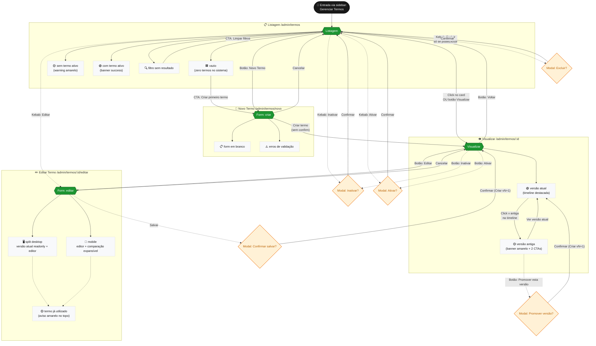

# Gerenciar Termos — Mapa de Fluxos e Estados

Documento de referência para handoff com o time de front-end e como guia visual durante o desenvolvimento.

Cobre todos os caminhos possíveis do usuário **dentro do módulo de Gerenciar Termos** do painel Admin.

> 📌 Atualizar este documento sempre que uma nova rota, estado ou modal for adicionado. Atualizar também o frontmatter (`ultima_revisao` e `afeta`/`afetadoPor` se houver mudança).

---

## 1. Diagrama de fluxo

Visualização completa das rotas, estados e transições. O GitHub renderiza Mermaid nativamente — basta abrir este arquivo no repo.

### Legenda

| Símbolo | Significado |
|---|---|
| 🟢 retângulo grande verde | Rota (URL real) |
| 🟦 retângulo cinza | Estado de uma rota |
| 🟡 losango amarelo | Modal / dialog |
| → linha sólida | Navegação direta |
| -.-> linha pontilhada | Abre modal ou ação fora da navegação |

---

## 2. Inventário de estados por tela

### 2.1 Listagem — `/admin/termos`

| Estado | Quando ocorre | UI mostrada | Componente fonte |
|---|---|---|---|
| **Lista vazia** | `store.todos.length === 0` (nenhum termo cadastrado) | Empty state com ícone + título "Nenhum termo cadastrado ainda." + CTA filled **"Criar primeiro termo"** | `pages/admin/termos/Index.vue` |
| **Sem termo ativo** | Há termos, mas nenhum com `ativo: true` | Banner warning amarelo no topo: "Nenhum termo ativo no momento. Pedidos não poderão ser formalizados…" | `pages/admin/termos/Index.vue` |
| **Com termo ativo** | Existe um termo `ativo: true` (sempre 1 no máximo) | Banner success verde com ícone check + nome do termo + versão atual: "Termo ativo: X (vN)" | `pages/admin/termos/Index.vue` |
| **Filtro sem resultado** | Lista filtrada vazia, mas há termos no sistema | Empty state com título "Nenhum termo corresponde aos filtros." + CTA outlined **"Limpar filtros"** | `pages/admin/termos/Index.vue` |
| **Card destacado (ativo)** | Cada card individual quando `termo.ativo === true` | Borda verde 2px + bg `#FAFFFB` | `features/term/components/TermCard.vue` |
| **Card pulsing** | Termo recém-ativado (1.5s pós-confirm) | Box-shadow expansivo verde animado | `features/term/components/TermCard.vue` |
| **Card hover** | Mouse sobre card | Borda mais escura + box-shadow sutil | `features/term/components/TermCard.vue` |
| **Kebab aberto** | Click no botão ⋮ | Menu com 3 itens (Editar, Ativar/Inativar, Excluir) | `features/term/components/TermCard.vue` |
| **Kebab sem Excluir** | `podeExcluir(termo) === false` (alguma versão utilizada) | Menu sem o item Excluir nem o divisor | `features/term/components/TermCard.vue` |

### 2.2 Visualizar — `/admin/termos/:id`

| Estado | Quando ocorre | UI mostrada | Componente fonte |
|---|---|---|---|
| **Termo não encontrado** | id inválido na URL | Alert error: "Termo não encontrado." + botão Voltar | `pages/admin/termos/View.vue` |
| **Vendo versão atual** | `versaoSelecionadaIdx === null` ou aponta pra última | Card de conteúdo limpo, sem banner; timeline com "v atual" destacada (dot verde + ring) | `pages/admin/termos/View.vue` |
| **Vendo versão antiga** | `versaoSelecionadaIdx < última` | Banner amarelo "Você está vendo a versão vN" com 2 CTAs: **Promover esta versão** (mdi-restore, outlined) e **Ver versão atual** (mdi-fast-forward, filled) | `pages/admin/termos/View.vue` |
| **Versão utilizada (qualquer)** | `versao.utilizado === true` | Tag laranja "Utilizada" no item da timeline + lista de pedidos vinculados | `pages/admin/termos/View.vue` |
| **Action bar termo ativo** | `termo.ativo === true` | Botão middle vira **Inativar** (warning) | `pages/admin/termos/View.vue` |
| **Action bar termo inativo** | `termo.ativo === false` | Botão middle vira **Ativar** (success) | `pages/admin/termos/View.vue` |
| **Conteúdo Markdown** | Sempre — ao renderizar `versaoExibida.conteudo` | Headings, negrito, listas, blockquote renderizados | `features/term/components/TermContent.vue` |
| **Fade entre versões** | Trocou `versaoExibida` | Transição opacity 180ms | `pages/admin/termos/View.vue` |

### 2.3 Form — `/admin/termos/novo` e `/admin/termos/:id/editar`

> 📌 **Decisão de produto (validação 2026-04-26):** toda edição em termo
> sempre cria uma nova versão. Não há mais opção de "sobrescrever".

| Estado | Quando ocorre | UI mostrada | Componente fonte |
|---|---|---|---|
| **Modo criação** | rota `/novo`, `id === undefined` | Título "Novo Termo", layout single-column, editor TipTap full-width. Action bar: Cancelar + **Criar termo** (sem modal de confirmação — vai direto) | `pages/admin/termos/Form.vue` |
| **Modo edição — split desktop** | `mdAndUp && isEdit && versaoAtual` | **Layout 2 colunas 50/50**, gap 24px. Esquerda: card cinza-claro com tag "VERSÃO ATUAL · vN · somente leitura" + nome readonly + editor readonly (toolbar acinzentada para alinhar visual). Direita: card branco com tag "NOVA VERSÃO · vN+1 · edição" + nome editável + editor TipTap completo | `pages/admin/termos/Form.vue` |
| **Modo edição — mobile** | `!mdAndUp && isEdit` | Layout single-column. Editor TipTap em cima. Bloco "Conteúdo atual (somente leitura)" **expandido por padrão** abaixo, com botão para colapsar/expandir | `pages/admin/termos/Form.vue` |
| **Modo edição — termo utilizado** | `isEdit && termoUtilizado` | Alert warning no topo da tela (acima do split): "Este termo já foi utilizado em pedidos e não pode ser sobrescrito…" + badge "Já utilizado" no subtítulo (com tooltip explicativo) | `pages/admin/termos/Form.vue` |
| **Validação ativa** | Submit com campo vazio/inválido | Nome: erro inline via `hide-details="auto"`. Conteúdo: erro abaixo do editor via `conteudoErro` (string ref) — TipTap não dispara `:rules` do v-form, validação manual | `pages/admin/termos/Form.vue` |
| **Editor com scroll interno** | Sempre que conteúdo > altura disponível | Editor tem `min-height: 360px; max-height: calc(100vh - 320px)` no desktop. Toolbar fixa no topo, conteúdo rola dentro de `.editor-content` | `features/term/components/TermEditor.vue` |

### 2.4 Editor TipTap — toolbar e palavras-chave

| Estado | Quando ocorre | UI mostrada | Componente fonte |
|---|---|---|---|
| **Toolbar editável** | Editor em modo edição | Botões B/I/U/Strike, dropdown de estilo (Parágrafo, Título 1/2/3) com largura fixa 130px, listas, alinhamento, undo/redo, **CTA verde "Inserir palavra-chave"** | `features/term/components/TermEditor.vue` |
| **Toolbar readonly** | Lado esquerdo do split desktop | Mesma toolbar, **acinzentada** (opacity 0.5 + pointer-events: none + CTA em cinza) — mantém altura para alinhar linha-a-linha com o lado editável | `features/term/components/TermEditor.vue` |
| **Dropdown de palavras-chave aberto** | Click no CTA verde | Menu vertical com 7 categorias (Pedido, Lojista, Facção, Detalhes do Pedido, Valores, Local, Assinaturas) e 26 keywords categorizadas em fonte mono. Click insere literal `[Texto]` na posição do cursor | `features/term/components/TermEditor.vue` |
| **Chip de palavra-chave** | Texto entre `[ ]` que está em `VALID_KEYWORDS` | Span destacado com bg laranja-claro, borda tracejada laranja, **preserva formatação contextual** (negrito/itálico/heading) via `font-*: inherit` | `features/term/components/TermContent.vue` + `KeywordHighlight` extension |
| **Texto entre `[ ]` não-keyword** | Ex: `[Algo aleatório]` ou keyword digitada com erro | Renderizado como **texto comum** (sem chip) — sinaliza ao admin que não será reconhecido pelo backend | `KeywordHighlight` extension |
| **Line numbers (gutter)** | Sempre — em todos os editores | Coluna fina à esquerda com número em mono cinza, alinhada com o topo de cada bloco top-level (parágrafo, heading, lista, blockquote). Implementado via CSS counter | `features/term/components/TermEditor.vue` |

---

## 3. Catálogo de modais

Todos seguem o padrão visual definido em `components/perguntas-frequentes/ConfirmDialog.vue`:
- **Desktop:** botões horizontais alinhados à direita
- **Mobile:** botões empilhados full-width (primário em cima)

| Modal | Quando abre | Título | Mensagem | Botão confirmar | Cor confirm |
|---|---|---|---|---|---|
| **Inativar** | Kebab > Inativar (no card) **OU** botão Inativar (na View) | "Inativar termo?" | "Sem termo ativo, novos pedidos não poderão ser formalizados." | **Inativar** | `warning` |
| **Ativar** | Kebab > Ativar (no card) **OU** botão Ativar (na View) | "Ativar este termo?" | *Dinâmica:* "'X' será desativado automaticamente. Apenas um termo pode estar ativo por vez." (se há outro ativo) ou *"Apenas um termo pode estar ativo por vez. Nenhum termo está ativo no momento."* | **Ativar** | `success` |
| **Excluir** | Kebab > Excluir (só aparece se podeExcluir) | "Excluir termo?" | "Esta ação não pode ser desfeita. Como o termo nunca foi utilizado, pode ser removido com segurança." | **Excluir** | `error` |
| **Promover versão** | Botão "Promover esta versão" no banner amarelo da View | "Promover esta versão?" | "Será criada uma nova versão **vN+1** com o conteúdo da vN. As versões anteriores são mantidas no histórico." | **Criar vN+1** | `primary` |
| **Confirmar salvar (criação)** | Submit do Form em modo novo (após validação OK) | — _(criação não pede confirmação; vai direto)_ | — | — | — |
| **Confirmar salvar (edição — termo não utilizado)** | Submit do Form em modo edição, `!termoUtilizado` | "Criar nova versão" | "Uma nova versão (**vN+1**) será criada e a versão anterior será preservada no histórico." | **Criar vN+1** | `primary` |
| **Confirmar salvar (edição — termo utilizado)** | Submit do Form em modo edição, `termoUtilizado=true` | "Salvar como nova versão" | "Este termo já foi utilizado em pedidos. As mudanças serão salvas como uma nova versão (**vN+1**) para preservar o histórico." | **Criar vN+1** | `primary` |

### Microcopy de feedback (snackbar pós-ação)

| Ação | Mensagem | Duração | Origem |
|---|---|---|---|
| Termo criado | "Termo criado. Ative-o para começar a usar em pedidos." | 5s (flash) | `FlashSnackbar` global |
| Edição salva | "Nova versão criada (vN+1)." | 4s | `FlashSnackbar` global |
| Termo ativado (havia outro ativo) | `"X" está ativo. "Y" foi desativado automaticamente.` | 2.5s | snackbar local da Index |
| Termo ativado (primeiro ativo) | `"X" está ativo.` | 2.5s | snackbar local da Index |
| Termo inativado | "Termo inativado." | 2.5s | snackbar local da Index |
| Termo excluído | "Termo excluído." | 2.5s | snackbar local da Index |
| Versão promovida | "Versão promovida. Uma nova versão atual foi criada com o conteúdo antigo." | 4s (flash) | `FlashSnackbar` global |

---

## 4. Decisões de UI baseadas em dados

Lista das condicionais que o front precisa preservar quando substituir o mock por backend real. **Cada uma delas é hoje um helper no store** — o nome ao lado é a função real.

### 4.1 Estado do termo

| Regra | Helper | Resultado | Onde é usada |
|---|---|---|---|
| **Versão atual de um termo** | `store.versaoAtual(termo)` | Retorna o último item de `termo.versoes[]` | View, Form, Card |
| **Termo já vinculado a algum pedido** | `store.foiUtilizado(termo)` | `true` se qualquer versão tem `utilizado: true` | Card (label "Uso"), Form (alert + badge), regra de exclusão |
| **Pode excluir o termo?** | `store.podeExcluir(termo)` | `!foiUtilizado(termo)` | Card (esconde item Excluir do kebab), confirm dialog |

### 4.2 Estado global (sistema)

| Regra | Como | Onde é aplicada |
|---|---|---|
| **Apenas 1 termo ativo por vez** | Action `store.ativar(id)` desativa todos os outros antes de ativar o alvo | Index, View, ConfirmDialog de ativar |
| **Termo ativo no topo da listagem** | Getter `store.todos` ordena `ativo: true` primeiro, depois por `updatedAt` desc | Listagem |
| **Banner de termo ativo na Index** | Getter `store.ativo` retorna o termo ativo ou `null` | Banner success / warning |

### 4.3 Versionamento

> 📌 **Decisão de produto (validação 2026-04-26):** todo `salvarEdicao` cria
> uma nova versão. Não há mais "sobrescrever".

| Cenário | Comportamento |
|---|---|
| **Edição (qualquer caso, utilizado ou não)** | `store.salvarEdicao(id, input)` **sempre** cria entrada `{ versao: atual.versao + 1, conteudo, utilizado: false, pedidosVinculados: [] }` em `termo.versoes[]`. Não há mais sobrescrita. Atualiza `termo.nome` e `termo.updatedAt` |
| **Promover versão antiga** | `store.promoverVersao(id, versao)` cria nova versão `{ versao: maxVersao + 1, conteudo: versaoAntiga.conteudo, utilizado: false, pedidosVinculados: [] }`. Não modifica nenhuma versão anterior |
| **Próxima versão (preview no modal)** | `max(termo.versoes[].versao) + 1` — exibido no botão "Criar vN+1" e na mensagem de confirmação |

### 4.4 Pluralização e formatação

| Campo | Lógica | Exemplos |
|---|---|---|
| **Label de uso no card** | Conta `Set` de ids únicos em `versoes[].pedidosVinculados[]` | `"Nunca utilizado"` / `"Vinculado a 1 pedido"` / `"Vinculado a 3 pedidos"` |
| **Data de atualização** | `new Date(updatedAt).toLocaleDateString('pt-BR')` | `"26/04/2026"` |
| **Total de versões no card** | `termo.versoes.length` | `"v2 (4 versões)"` se > 1 |

### 4.5 Editor TipTap & palavras-chave

| Regra | Como | Onde é aplicada |
|---|---|---|
| **Conteúdo armazenado em HTML** | TipTap nativamente trabalha em HTML; backend reconhece tags básicas (h1-h3, strong, em, u, ul, ol, li, blockquote, p) | Save em `versao.conteudo`, render em `TermContent` |
| **Catálogo de palavras-chave** | Arquitetura em duas camadas dentro de `src/features/term/`: `constants/termKeywordsContract.ts` (`TERM_KEYWORD_VALUES` — fonte da verdade do backend, 21 strings únicas) e `constants/termKeywords.ts` (`TERM_KEYWORDS` — apresentação UX com 26 entradas em 7 categorias, **5 duplicatas intencionais** para descoberta visual). `VALID_KEYWORDS` (Set O(1)) deriva do contrato. Ver `docs/admin/TERMOS_KEYWORDS.md` | Dropdown do editor + validação de chip |
| **Validação estrita de placeholder** | `isValidKeyword(text)` checa se `text` está em `VALID_KEYWORDS`. Texto entre `[ ]` que não está na lista **NÃO** ganha chip visual — sinaliza ao admin que digitou errado e o backend não reconhecerá | `KeywordHighlight` extension (TipTap) e `TermContent` (HTML render) |
| **Chip preserva formatação contextual** | `.kw-chip` usa `font-*: inherit` em vez de fixar weight/size/family. Se a palavra-chave está dentro de `<strong>`, o chip aparece negrito; idem para heading e itálico | Tanto no read-only quanto no editor live (via decoração ProseMirror) |
| **Migração markdown legado** | Se `conteudo` não começa com tag HTML, `TermContent` converte via `marked` antes de renderizar. Evita quebrar termos antigos do localStorage de antes da migração | `TermContent.vue` |
| **Sanitização** | Todo HTML renderizado via `v-html` passa por DOMPurify com whitelist de tags/atributos | `TermContent.vue` |
| **Scroll interno do editor** | `min-height: 360px; max-height: calc(100vh - 320px)` no `.termo-editor` (desktop). Toolbar `flex-shrink: 0` no topo, `.editor-content` com `overflow-y: auto` | `TermEditor.vue` |
| **Toolbar com altura fixa** | `min-height: 48px; flex-wrap: wrap`; dropdown de estilo com `width: 130px` fixo. Garante que o split desktop tenha as duas toolbars idênticas regardless do conteúdo selecionado | `TermEditor.vue` |

### 4.6 Cor do círculo do card

Hash determinístico do `termo.id` mapeado pra paleta de 6 cores. Mesmo termo sempre tem mesma cor. Ver `features/term/components/TermCard.vue:corCirculo`.

### 4.6 Topbar mobile dinâmica

`AdminLayout.vue:pageTitleMobile` usa `route.path` + `route.params.id` + `termosStore.porId()` para mostrar:
- `/admin/termos` → "Gerenciar Termos"
- `/admin/termos/novo` → "Novo termo"
- `/admin/termos/:id` → nome do termo
- `/admin/termos/:id/editar` → "Editar: <nome>"

---

## 5. Checklist de cobertura para o dev

Use isso como checklist enquanto desenvolve cada tela, garantindo que nenhum estado foi esquecido.

### Listagem
- [ ] Empty state com zero termos
- [ ] Banner de termo ativo (success)
- [ ] Banner de "nenhum termo ativo" (warning)
- [ ] Filtro com 0 resultados
- [ ] Card de termo ativo destacado (borda verde)
- [ ] Card de termo recém-ativado com pulse (1.5s)
- [ ] Hover state do card
- [ ] Kebab abre/fecha
- [ ] Kebab sem item "Excluir" quando termo já foi usado
- [ ] Click no card → navega para View
- [ ] Click nos botões/kebab → não dispara navegação do card

### Visualizar
- [ ] Termo não encontrado (id inválido na URL)
- [ ] Estado "vendo versão atual"
- [ ] Estado "vendo versão antiga" com banner amarelo
- [ ] Timeline com versões em ordem desc, atual destacada
- [ ] Tag "Utilizada" nas versões com `utilizado: true`
- [ ] Lista de pedidos vinculados quando aplicável
- [ ] Conteúdo renderizado em Markdown
- [ ] Transição fade ao trocar de versão
- [ ] Action bar sticky no rodapé com botão Inativar/Ativar dinâmico
- [ ] Action bar não cobre conteúdo (flex layout do page-wrapper)

### Form (Criar/Editar)
- [ ] Modo criação: sem alertas, layout single-column, sem modal de confirmação
- [ ] Modo edição desktop: split 50/50 com versão atual readonly à esquerda
- [ ] Modo edição mobile: editor + bloco "Conteúdo atual" expandido por padrão (com toggle)
- [ ] Termo utilizado: alert warning amarelo + badge "Já utilizado" com tooltip (NÃO há mais radio de estratégia em nenhum caso)
- [ ] Validação inline do nome via `hide-details="auto"`
- [ ] Validação manual do conteúdo (TipTap) com erro inline abaixo do editor
- [ ] Confirmação antes de salvar em modo edição (sempre cria nova versão)
- [ ] Action bar sticky com botões corretos por modo

### Editor TipTap
- [ ] Toolbar visível: B/I/U/Strike, dropdown de estilo (130px fixo), listas, alinhamento, undo/redo, CTA verde "Inserir palavra-chave"
- [ ] Toolbar fixa no topo do editor (flex-shrink: 0)
- [ ] Conteúdo do editor rola internamente quando excede `max-height` (desktop)
- [ ] Mobile: scroll natural da página (sem max-height)
- [ ] Gutter de line numbers à esquerda alinhado com cada bloco top-level
- [ ] Modo readonly: toolbar acinzentada (mesma altura) + editor sem cursor
- [ ] Split desktop: linhas alinham linha-a-linha entre as duas colunas
- [ ] Dropdown de palavras-chave: 7 categorias, 26 keywords (lista exata do backend, com duplicatas)
- [ ] Inserção de keyword: insere literal `[Texto]` na posição do cursor
- [ ] Chip de keyword só aparece se for keyword válida (texto entre `[ ]` fora da lista vira texto comum)
- [ ] Chip preserva formatação contextual (negrito/itálico/heading)

### Modais
- [ ] Padrão visual consistente (desktop horizontal, mobile empilhado)
- [ ] Mensagem do confirm de **Ativar** menciona o nome do termo desativado
- [ ] Mensagem do confirm de **Promover** menciona qual `vN+1` será criada
- [ ] Mensagem do confirm de **Salvar edição** menciona qual `vN+1` será criada
- [ ] Item "Excluir" no kebab fica em vermelho com divisor acima
- [ ] Botão de confirmar destrutiva (Excluir) é vermelho
- [ ] **NÃO existe** modal de "sobrescrever versão atual" — foi removido

### Snackbars
- [ ] Snackbar local da Index para ações disparadas dali
- [ ] FlashSnackbar global para mensagens que sobrevivem a redirect (criar/editar termo, promover versão)
- [ ] Snackbar de criação inclui CTA implícita ("Ative-o para começar a usar")
- [ ] Snackbar pós-edição menciona a versão criada ("Nova versão criada (vN+1)")

---

## Apêndice — referência rápida de rotas

| Rota | Componente | Permissão |
|---|---|---|
| `/admin/termos` | `pages/admin/termos/Index.vue` | role: admin |
| `/admin/termos/novo` | `pages/admin/termos/Form.vue` (modo create) | role: admin |
| `/admin/termos/:id` | `pages/admin/termos/View.vue` | role: admin |
| `/admin/termos/:id/editar` | `pages/admin/termos/Form.vue` (modo edit) | role: admin |

Definições em `src/router/index.ts`.

---

## Histórico de decisões

Registro das decisões que evoluíram ao longo do projeto. **Versões superadas não voltam** — se uma proposta nova parece igual à versão antiga, é sinal de alerta (ver `CLAUDE.md` § 4).

| Data | Decisão | Status | Motivo |
|---|---|---|---|
| 2026-04-26 | Sobrescrever vs nova versão na edição do termo | **Superada** | Editor passou a sempre criar nova versão. Garante histórico imutável e rastreabilidade pra pedidos vinculados. Não regredir. |
| 2026-04-26 | Termo como "evento" na timeline do pedido | **Superada** | Termo virou fase à parte do pedido (assinatura). Não voltar a tratar como evento de timeline. |
| 2026-05-19 | Arquivo único `src/types/termoKeywords.ts` misturando contrato + UX + regex | **Superada** (refactor do Sancho, MR !2) | Separado em `src/features/term/{constants,types,utils}/` + `__tests__/`. Não voltar a juntar. |
| 2026-05-19 | Regex `/\[([^\]]+)\]/g` (permissiva) | **Superada** | Substituída por `/\[([\p{L}\p{N} .,:"/()\-$]+)\]/gu` (charset explícito). Não voltar à permissiva. |
| 2026-05-19 | Comentários longos no topo de `termKeywords.ts` (15+ linhas) | **Superada** | Contexto extenso movido para `docs/admin/TERMOS_KEYWORDS.md`. Comentários de arquivo passam a ser de 3-5 linhas. |

