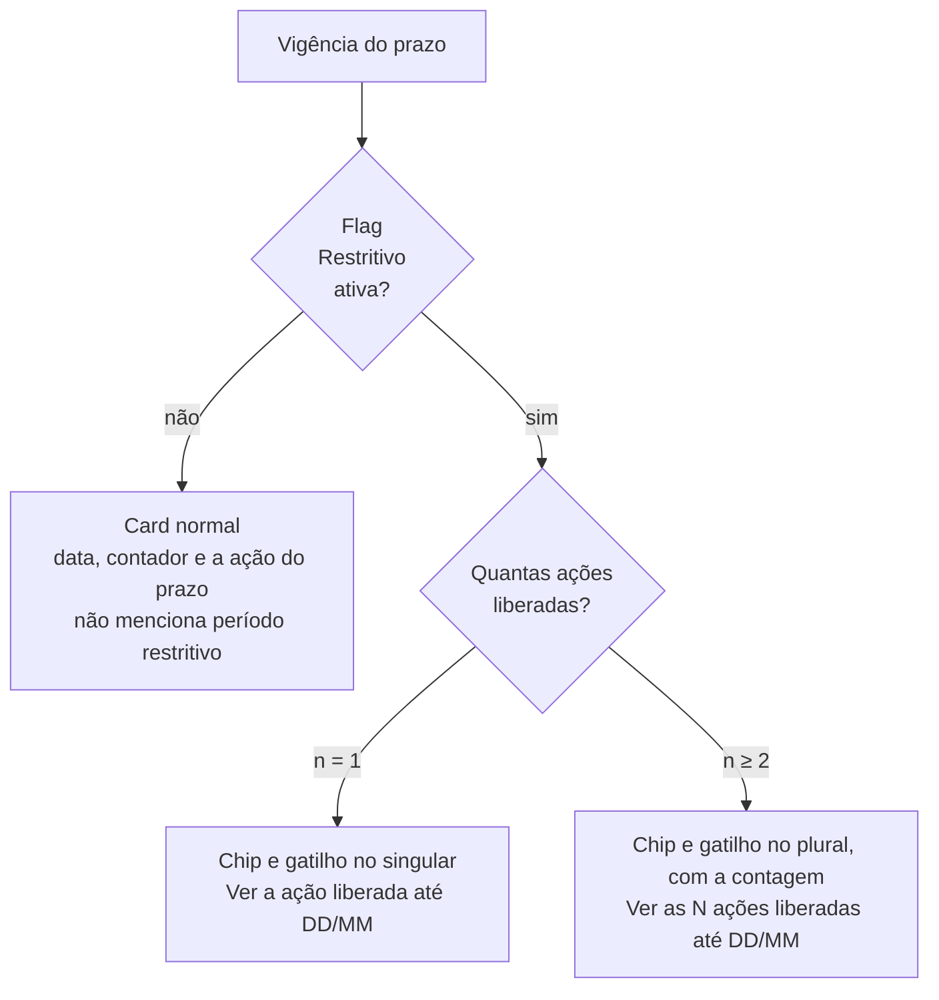

# Por que o dashboard da entidade gestora ficou assim

**Recicla Goiás · Sistema · Área da Entidade Gestora**
Registro de decisão de design · 13 de agosto de 2026 · Bruno Marques, UX

---

Este documento justifica quatro decisões de interface do dashboard da entidade gestora: o
**card de prazo**, o **popover do período restritivo**, o **seletor de ano de execução** e o
card de **Status da Documentação**.

Cada uma abre com o problema que resolve, mostra as alternativas que foram descartadas e
termina com a evidência que sustenta a escolha.

### Sumário

| | Seção |
|---|---|
| 1 | [O problema: uma lista que cresce dentro de um card que não pode crescer](#1-o-problema) |
| 2 | [As três hipóteses e por que duas caíram](#2-as-três-hipóteses) |
| 3 | [A decisão: o card avisa e conta, o popover mostra](#3-a-decisão) |
| 4 | [O popover: por que não é modal nem tooltip](#4-o-popover) |
| 5 | [O seletor de ano de execução](#5-o-seletor-de-ano-de-execução) |
| 6 | [Status da Documentação](#6-status-da-documentação) |
| 7 | [A evidência](#7-a-evidência) |
| 8 | [Roteiro para navegar no protótipo](#8-roteiro-para-navegar-no-protótipo) |

---

## 1. O problema

O dashboard da entidade gestora tem dois cards de prazo, um para planos e outro para
relatórios. Quando a vigência está marcada como **restritiva**, o card precisa comunicar
esse estado e dar acesso às ações que a janela excepcional libera.

> **Período restritivo** é uma extensão de um prazo que já terminou. Não está no calendário,
> não é rotina e acontece em casos específicos, liberando apenas algumas ações.

O número dessas ações é configurável por flag no admin. E é aí que está o problema:

```
        hoje                         expectativa
   ┌───────────┐                  ┌───────────────┐
   │  2 ações  │  ─────────────▶  │  esse número  │
   └───────────┘                  │    cresce     │
                                  └───────────────┘
```

Com a lista dentro do card, **cada ação nova empurrava o layout**. A data, que é o dado pelo
qual o card existe, ia perdendo espaço para uma lista de regras administrativas. Um card de
dashboard precisa responder "o que mudou para mim?" num relance; uma parede de bullets faz o
contrário.

---

## 2. As três hipóteses

| | Hipótese | Como funciona | Por que caiu |
|---|---|---|---|
| **A** | Todas as ações inline | Rótulo do estado mais a lista completa no card, sem clique | Funciona com 2. Conforme o número cresce, o card dobra de altura e a data deixa de dominar |
| **B** | "Período restritivo" como link | O próprio rótulo do estado vira o elemento clicável | O rótulo é jargão administrativo: não promete nada, então a pessoa não clica. E se abre uma camada em vez de navegar, não deveria ser link |
| **C** | Ícone que abre modal | Um ícone ao lado do rótulo abre janela com explicação e lista | Modal interrompe a tarefa e obriga a decorar as regras para aplicá-las depois que fecha. Ícone sozinho também não comunica |

**O diagnóstico que destravou a decisão:** o que a pesquisa condena não é o clique, é o
rótulo. "Período restritivo" sozinho não diz que existe algo liberado do outro lado. Um
gatilho que declare o conteúdo resolve a objeção e libera a lista para sair do card.

---

## 3. A decisão

> **O card avisa e conta. O popover mostra.**
>
> Em vez do rótulo cru, o gatilho declara três coisas: o **assunto**, o **tamanho do
> conjunto** e o **prazo**. Exemplo: *"Ver as 6 ações liberadas até 29/08"*.

### Anatomia do card

```
┌───────────────────────────────────────────────┐
│  PRAZO · PLANOS 2024                   ┌────┐ │  eyebrow: escopo da vigência
│  29/08/2026                            │ 17 │ │  data de fim (dado principal)
│  Faltam 18 dias para o fim do prazo    └────┘ │  contador diz PARA QUE serve a data
│                                               │
│  ┌─────────────────────────────────────────┐  │
│  │ ┃ Período restritivo ┃                  │  │  chip vermelho: só o ESTADO
│  │                                         │  │
│  │ (i) Ver as 6 ações liberadas até 29/08  │  │  gatilho: assunto, contagem e prazo
│  └─────────────────────────────────────────┘  │
└───────────────────────────────────────────────┘
```

Ver no Figma: [REC-02, situação de hoje](https://www.figma.com/design/aNvL38L8uyxh8zBeHfsHiD/Incentiva-Goi%C3%A1s?node-id=2601-14778)

### A prova: o card não cresce

```
      1 ação                2 ações · hoje          6 ações              20 ações
┌──────────────────┐   ┌──────────────────┐   ┌──────────────────┐   ┌──────────────────┐
│ PRAZO · PLANOS   │   │ PRAZO · PLANOS   │   │ PRAZO · PLANOS   │   │ PRAZO · PLANOS   │
│ 29/08/2026       │   │ 29/08/2026       │   │ 29/08/2026       │   │ 29/08/2026       │
│ Faltam 18 dias   │   │ Faltam 18 dias   │   │ Faltam 18 dias   │   │ Faltam 18 dias   │
│ ┌──────────────┐ │   │ ┌──────────────┐ │   │ ┌──────────────┐ │   │ ┌──────────────┐ │
│ │Período restr.│ │   │ │Período restr.│ │   │ │Período restr.│ │   │ │Período restr.│ │
│ │(i) Ver a     │ │   │ │(i) Ver as 2  │ │   │ │(i) Ver as 6  │ │   │ │(i) Ver as 20 │ │
│ │    ação...   │ │   │ │    ações...  │ │   │ │    ações...  │ │   │ │    ações...  │ │
│ └──────────────┘ │   │ └──────────────┘ │   │ └──────────────┘ │   │ └──────────────┘ │
└──────────────────┘   └──────────────────┘   └──────────────────┘   └──────────────────┘

        ◀────────────────── todos com a mesma altura ──────────────────▶
```

**O número de ações virou só um número dentro de um rótulo.** O problema de escala deixou de
existir: o componente serve 2 ações hoje e 20 depois, sem redesenho.

Ver no Figma: [Estados do card de prazo](https://www.figma.com/design/aNvL38L8uyxh8zBeHfsHiD/Incentiva-Goi%C3%A1s?node-id=2619-6536)

### O card nunca mostra qual ação está liberada

Uma versão intermediária abria exceção para uma ação só: em vez de contar, o card trazia a
ação para uma frase. Foi descartado por três motivos.

1. **Quebrava a altura constante**, que é justamente o ganho da decisão.
2. **Criava um segundo jeito de ler o mesmo bloco.** Contar é uma regra; contar às vezes e
   mostrar às vezes são duas.
3. **Obrigava a redigir e manter uma frase para cada ação do catálogo**, com concordância
   própria, o que não escala junto com as flags.

Com uma ação só, o gatilho apenas vai para o singular: *"Ver a ação liberada até 02/09"*.

### A máquina de estados



| Ações liberadas | O que o card faz |
|---|---|
| **0** | Estado inexistente. Vigência marcada como restritiva sem nenhuma ação liberada não é salva, porque o parâmetro só é tocado depois da decisão tomada |
| **1** | Chip e gatilho no singular. A ação não aparece no card |
| **2 ou mais** | Chip e gatilho no plural, com a contagem. A lista vive no popover |

O estado é **por card**: planos e relatórios têm vigências, flags e listas independentes,
então a janela pode estar restritiva num e normal no outro. Ver no Figma:
[REC-03, 6 ações num card e 1 no outro](https://www.figma.com/design/aNvL38L8uyxh8zBeHfsHiD/Incentiva-Goi%C3%A1s?node-id=2601-15216)

### Duas decisões de forma

**O vermelho ficou**, por requisição do cliente. Ele carrega o estado, e só ele; o gatilho
fica em verde de link para o bloco não virar um alarme inteiro. Onde a interface fala do
prazo normal, o período restritivo não é mencionado: só se fala dele quando a flag está
ativa. Ver no Figma:
[REC-01, dentro do prazo](https://www.figma.com/design/aNvL38L8uyxh8zBeHfsHiD/Incentiva-Goi%C3%A1s?node-id=2601-15048)

**Uma data só.** A tela de parâmetros do admin tem uma vigência com início, fim, o toggle
*Restritivo* e as flags. Não são duas janelas encadeadas. O card mostra a data de fim, e o
contador diz para que ela serve: *"Faltam 18 dias para o fim do prazo"*.

---

## 4. O popover

O detalhe abre **por clique**, ancorado no gatilho, sem sair do dashboard e sem escurecer a
tela.

```
                     (i) Ver as 6 ações liberadas até 29/08
                      │
                      ▼
      ┌───────────────────────────────────────────┐
      │ (i) Período restritivo                 ✕  │
      │                                           │
      │ É uma extensão de um prazo que já         │
      │ terminou. Não está no calendário, não é   │
      │ rotina e acontece em casos específicos,   │
      │ liberando apenas algumas ações.           │
      │ ─────────────────────────────────────────  │
      │ LIBERADAS ATÉ 29/08                       │
      │  ✓ Incluir nota fiscal                    │
      │  ✓ Excluir nota fiscal                    │
      │  ✓ Retificar relatório enviado            │
      │  ✓ Ajustar massa recuperada               │
      │  ✓ Incluir nota duplicada no relatório…   │
      │  ✓ Substituir certificado de massa        │
      └───────────────────────────────────────────┘
```

O parágrafo de explicação não é enfeite. Ele responde a um risco real, que é a entidade
tratar o período restritivo como um segundo prazo regular. Dizer que não está no calendário
e que acontece em casos específicos é o que desmonta essa expectativa.

Ver no Figma:
[Popover em quatro dimensões](https://www.figma.com/design/aNvL38L8uyxh8zBeHfsHiD/Incentiva-Goi%C3%A1s?node-id=2613-16992)
e [aberto sobre a tela](https://www.figma.com/design/aNvL38L8uyxh8zBeHfsHiD/Incentiva-Goi%C3%A1s?node-id=2613-17394)

### Por que não modal

Modal interrompe por design e é o padrão de maior custo de acessibilidade, porque exige
gerenciamento de foco, armadilha de foco, retorno de foco e tecla de escape. Pior: obriga a
pessoa a **memorizar as regras** para aplicá-las depois que a janela fecha. O popover não
bloqueia nada porque o conteúdo é de consulta, não de decisão.

### Por que não tooltip em hover

Em tela de toque hover simplesmente não existe. E, quando existe, conteúdo revelado por
hover passa a ter obrigações formais de acessibilidade: precisa ser dispensável sem mover o
mouse, permanecer aberto ao passar o cursor por cima e não sumir sozinho. Muita exigência
para pouco conteúdo, e ainda deixa metade dos usuários de fora.

### Comportamento por tamanho de lista

| Ações | Comportamento |
|---|---|
| 1 | O popover é o único lugar que diz qual é a ação, junto com o conceito |
| até 11 | Lista inteira visível, sem rolagem |
| 12 ou mais | A lista trava em **240 px** e rola. Cabeçalho, explicação e a linha "liberadas até DD/MM" ficam fixos |

O corte é por **altura**, não por contagem de itens: rótulos longos quebram em duas linhas e
ocupam o dobro do espaço. Travar a altura é honesto; fingir um número fixo de itens não
seria. Ver no Figma:
[REC-06, 20 ações com rolagem](https://www.figma.com/design/aNvL38L8uyxh8zBeHfsHiD/Incentiva-Goi%C3%A1s?node-id=2613-17596)

---

## 5. O seletor de ano de execução

As três pílulas fixas do sistema atual não sobrevivem a 2039, porque cada exercício novo
empurra o cabeçalho.

A primeira correção foi trocar por um **campo de seleção**. Resolve a escala, mas cobra um
clique para tudo e faz sumir a leitura dos anos vizinhos, que é justamente o movimento mais
comum: comparar o exercício atual com o anterior. **Descartada.**

> **O que ficou:** um segmentado de três células coladas, com botão de seta em cada ponta. O
> ano selecionado fica **sempre no centro** e as setas deslocam a janela inteira.

```
  meio da série                    ao clicar em ‹
┌───┬──────┬──────┬──────┬───┐   ┌───┬──────┬──────┬──────┬───┐
│ ‹ │ 2019 │ 2020 │ 2021 │ › │ ▶ │ ‹ │ 2018 │ 2019 │ 2020 │ › │
└───┴──────┴──▲───┴──────┴───┘   └───┴──────┴──▲───┴──────┴───┘
              │                                 │
        selecionado                       selecionado
       sempre no centro                  continua no centro
```

O selecionado **não pula de posição**, então o movimento é previsível. Nos extremos da série
a janela trava, a seta correspondente desabilita e o selecionado passa a ocupar a borda,
porque não existe exercício futuro nem anterior ao primeiro:

```
  exercício mais recente            primeiro exercício da série
┌───┬──────┬──────┬──────┬───┐   ┌───┬──────┬──────┬──────┬───┐
│ ‹ │ 2023 │ 2024 │ 2025 │ ░ │   │ ░ │ 2018 │ 2019 │ 2020 │ › │
└───┴──────┴──────┴──▲───┴───┘   └───┴──▲───┴──────┴──────┴───┘
                     │  desabilitada    │  desabilitada
              selecionado na borda   selecionado na borda
```

| Ganho | Por quê |
|---|---|
| Largura constante | Três células sempre, com 3 ou 30 exercícios |
| Vizinhos a um clique | Sem abrir nada, que é o caso de uso real |
| Continuidade visual | O cliente já reconhece o controle. Um campo de formulário mudaria a natureza do elemento: filtro de contexto não é campo de dado |

**Acessibilidade:** é um grupo de botões (`role="group"` com rótulo acessível), não um
`select`. Setas `←` e `→` movem entre os anos, `Home` e `End` vão para os extremos da série.
As setas de navegação recebem rótulo próprio e desabilitam com `disabled`, não apenas com
cor.

Ver no Figma:
[Seletor de ano, seis estados](https://www.figma.com/design/aNvL38L8uyxh8zBeHfsHiD/Incentiva-Goi%C3%A1s?node-id=2617-18084)

---

## 6. Status da Documentação

O título é requisição do cliente e ficou. O que mudou foi a representação.

A versão atual usa uma barra horizontal por tipo de documento, com uma **legenda separada**
logo abaixo do grupo. Dois problemas concretos:

1. **A legenda obriga um vaivém.** Para saber o que a faixa verde-clara significa, o olho
   precisa sair da barra, achar o item correspondente na legenda e voltar. Cada consulta
   custa esse trajeto.
2. **A informação fica codificada só em cor.** As faixas são tons próximos do mesmo verde,
   sem número e sem rótulo junto. Quem não distingue os tons não lê o dado.

> **O que ficou:** uma linha por tipo de documento, com barra empilhada e **contagem
> escrita** ao lado de cada status.

```
┌────────────────────────────────────────────────────────────────────┐
│  Status da Documentação                                            │
│  Planos, relatórios e certificados de massa do ano de execução     │
│                                                                    │
│  ┌──┐  Planos 2024   47 no total                    Ver planos ›   │
│  │▤ │  ███████████████████████▓▓▓▓▓░░░                             │
│  └──┘  ● 38 enviados   ● 6 retificados   ● 3 em preenchimento      │
│  ────────────────────────────────────────────────────────────────  │
│  ┌──┐  Relatórios 2024   52 no total             Ver relatórios ›  │
│  │▤ │  ██████████████▓▓▓▓▓▓▓▓▓▓▓▓▓▓                                │
│  └──┘  ● 31 enviados   ● 21 retificando                            │
└────────────────────────────────────────────────────────────────────┘
```

A linha é o módulo, e ela se adapta sozinha:

| Situação | O que aparece |
|---|---|
| 0 documentos | Uma frase: *"Nenhum plano enviado ainda."* Sem barra e sem contagem |
| 1 status | Ponto colorido e contagem, **sem barra** |
| 2 status ou mais | Barra empilhada e contagem por status, que quebra em duas linhas quando precisa |

### Por que a barra só aparece com dois status ou mais

Com um status só, a barra seria uma faixa cheia de uma cor só. Proporção só significa
alguma coisa quando existe algo com que comparar; uma barra de um segmento ocupa espaço e
não acrescenta informação nenhuma ao número que já está escrito ao lado. É aplicação direta
da oitava heurística de Nielsen, a de design minimalista: cada elemento a mais compete por
atenção com os que realmente importam.

### Por que a contagem fica escrita

Além de eliminar o vaivém até a legenda, é exigência normativa. O critério
[WCAG 1.4.1, Uso de Cor (nível A)](https://www.w3.org/WAI/WCAG21/Understanding/use-of-color.html),
é direto: *"Color is not used as the only visual means of conveying information"*. Com a
contagem e o rótulo ao lado do ponto, o dado sobrevive sem a cor.

Pelo mesmo motivo as cores saíram da escala de verdes e passaram a seguir o semáforo do
design system (sucesso, informação, atenção e neutro). Três tons próximos do mesmo verde são
difíceis de separar mesmo para quem enxerga cor normalmente, e ficam idênticos para boa
parte das pessoas com daltonismo.

Ver no Figma:
[Status da Documentação, cinco variações da linha](https://www.figma.com/design/aNvL38L8uyxh8zBeHfsHiD/Incentiva-Goi%C3%A1s?node-id=2613-16786)

---

## 7. A evidência

A pesquisa levantou **72 achados de fonte primária**, com cada URL verificada uma a uma. Os
que efetivamente decidiram alguma coisa são estes.

### Um rótulo só funciona como gatilho se prometer o que há do outro lado

A pessoa decide clicar estimando o valor do que vai encontrar; um rótulo genérico gasta o
clique sem entregar essa estimativa. É a razão de *"Período restritivo"* ter virado *"Ver as
6 ações liberadas até 29/08"*.
→ Nielsen Norman Group, [Information Scent](https://www.nngroup.com/articles/information-scent/)
e [Better Link Labels](https://www.nngroup.com/articles/better-link-labels/)

### Parte dos usuários evita clicar em gatilhos de "ver mais" por achar que sai da página

Evidência de campo do governo britânico, que por isso desaconselha esconder o que a maioria
precisa. Foi o que matou a hipótese do hyperlink e o que obrigou o popover a ser visivelmente
ancorado, não uma navegação.
→ GOV.UK Design System, [Details](https://design-system.service.gov.uk/components/details/)

### Modal é escolha pesada, reservada a quando a interação é obrigatória para continuar

Consultar quais ações estão liberadas não é isso. É consulta de referência, e o modal cobra
troca de atenção somada a carga de memória.
→ Nielsen Norman Group, [Modal & Nonmodal Dialogs](https://www.nngroup.com/articles/modal-nonmodal-dialog/)
e [Short-Term Memory and Web Usability](https://www.nngroup.com/articles/short-term-memory-and-web-usability/)

### Modal é último recurso: antes dele, procure um componente menos disruptivo

O padrão do governo dos EUA também documenta o teto de cinco itens para caixa compacta de
destaque, o que revelou que a lista não cabia no card muito antes de chegar a 6 ações.
→ U.S. Web Design System, [Modal](https://designsystem.digital.gov/components/modal/)
e [Summary box](https://designsystem.digital.gov/components/summary-box/)

### Rótulo de ícone precisa estar visível o tempo todo

Quase todo ícone é ambíguo sem texto ao lado. Por isso o `(i)` acompanha o rótulo e nunca o
substitui.
→ Nielsen Norman Group, [Icon Usability](https://www.nngroup.com/articles/icon-usability/)

### Um controle que abre camada na mesma página é botão, não link

E conteúdo revelado por hover ou foco tem obrigações formais: ser dispensável, permanecer ao
passar o cursor e não sumir sozinho. Duas normas que decidiram a forma do gatilho e
eliminaram o tooltip.
→ W3C/WAI, [ARIA APG · Disclosure](https://www.w3.org/WAI/ARIA/apg/patterns/disclosure/)
e [WCAG 2.1 · 1.4.13](https://www.w3.org/WAI/WCAG21/Understanding/content-on-hover-or-focus.html)

### Cor não pode ser o único meio de transmitir informação

Critério de nível A, o mais básico da norma. Sustenta a contagem escrita ao lado de cada
status e a troca da escala de verdes pelo semáforo.
→ W3C/WAI, [WCAG 2.1 · 1.4.1 Use of Color](https://www.w3.org/WAI/WCAG21/Understanding/use-of-color.html)

### Cada elemento a mais compete por atenção com os que importam

Base da decisão de não desenhar barra quando existe um status só, e de não listar status
zerado.
→ Nielsen Norman Group, [Aesthetic and Minimalist Design](https://www.nngroup.com/articles/aesthetic-minimalist-design/)

### Dashboard existe para consumo rápido, com o mínimo de processamento

É o argumento de fundo de todas as decisões: o que compete com o dado principal do card sai
do card.
→ Nielsen Norman Group, [Dashboards](https://www.nngroup.com/articles/dashboards-preattentive/)

---

## 8. Roteiro para navegar no protótipo

O dashboard está publicado e navegável. Não há autenticação real: o login é provisório e
serve para escolher o perfil.

**1. Entre como Entidade Gestora**
[reciclagoias.vercel.app/entrar](https://reciclagoias.vercel.app/entrar)
Um clique em "Entrar como Entidade Gestora" leva ao dashboard.

**2. Veja o dashboard**
[reciclagoias.vercel.app/gestora](https://reciclagoias.vercel.app/gestora)
O estado inicial é o de hoje: planos em período restritivo com 2 ações, relatórios dentro do
prazo.

**3. Abra o popover**
Clique em *"Ver as 2 ações liberadas até 29/08"*, no card de planos. Repare que a tela não
escurece e o dashboard continua legível atrás.

**4. Troque de cenário**
O botão **"Explorar cenários"**, no canto inferior esquerdo, abre um painel que edita a tela
ao vivo. Ele não faz parte do produto, existe só para inspeção. Use os atalhos:

| Cenário | O que mostra |
|---|---|
| **Hoje** | Situação atual, 2 ações liberadas |
| **REC-01** | Dentro do prazo, sem período restritivo |
| **REC-03** | 6 ações num card e 1 ação no outro, com a mesma altura |
| **REC-06** | 20 ações, com a lista do popover rolando |
| **Variações da linha** | O card de Status da Documentação com volume real |

No mesmo painel dá para ligar e desligar ações uma a uma e ver o rótulo do gatilho mudar de
singular para plural, e a contagem acompanhar.

**5. Teste o seletor de ano**
As setas nas pontas deslocam a janela de exercícios. Nos extremos da série a seta desabilita.
Funciona também pelo teclado, com `←`, `→`, `Home` e `End`.
