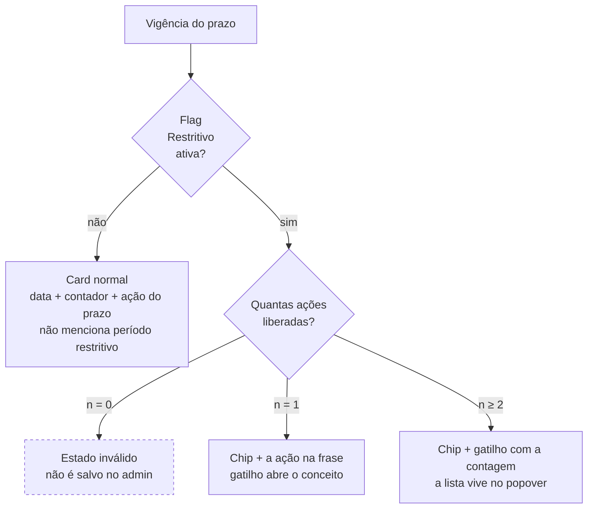
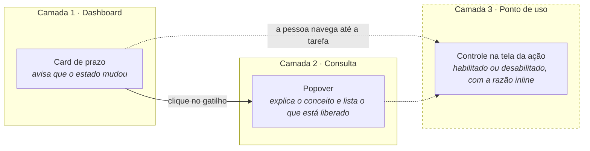

# Por que o dashboard da entidade gestora ficou assim

**Recicla Goiás · Sistema · Área da Entidade Gestora**
Registro de decisão de design — 12 de agosto de 2026 · Bruno Marques, UX

---

Este documento justifica três decisões de interface tomadas nesta rodada: o **card de
prazo**, o **popover do período restritivo** e o **seletor de ano de execução**.

Cada uma abre com o problema que resolve, mostra as alternativas que foram descartadas e
termina com a evidência que sustenta a escolha. A última seção diz onde essas decisões são
frágeis — **este documento foi escrito para ser contestado, não para vender**.

Os esboços correspondentes estão no Figma, frames `REC-01` a `REC-06`. O registro em formato
de consulta rápida fica em [`DECISOES-UX.md`](DECISOES-UX.md).

### Sumário

| | Seção |
|---|---|
| 1 | [O problema: uma lista que cresce dentro de um card que não pode crescer](#1-o-problema) |
| 2 | [As três hipóteses e por que duas caíram](#2-as-três-hipóteses) |
| 3 | [A decisão: o card avisa e conta, o popover mostra](#3-a-decisão) |
| 4 | [O modelo em três camadas](#4-o-modelo-em-três-camadas) |
| 5 | [O popover: por que não é modal nem tooltip](#5-o-popover) |
| 6 | [O seletor de ano de execução](#6-o-seletor-de-ano-de-execução) |
| 7 | [A evidência](#7-a-evidência) |
| 8 | [Onde estas decisões são frágeis](#8-onde-estas-decisões-são-frágeis) |
| 9 | [O que ainda falta construir](#9-o-que-ainda-falta-construir) |

---

## 1. O problema

O dashboard da entidade gestora tem dois cards de prazo — um para planos, outro para
relatórios. Quando a vigência está marcada como **restritiva**, o card precisa comunicar
esse estado e dar acesso às ações que a janela excepcional libera.

> **Período restritivo** é uma extensão excepcional de um prazo que já terminou. Não tem
> calendário e não é rotina: acontece quando a diretoria autoriza, caso a caso, e libera
> apenas algumas ações específicas.

O número dessas ações é configurável por flag no admin. E é aí que está o problema:

```
        hoje                          projeção do time
   ┌───────────┐                    ┌───────────────────┐
   │  2 ações  │  ───────────────▶  │   6 ações ou mais │
   └───────────┘                    └───────────────────┘
```

Com a lista dentro do card, **cada ação nova empurrava o layout**. A data — que é o dado
pelo qual o card existe — ia perdendo espaço para uma lista de regras administrativas. Um
card de dashboard precisa responder "o que mudou para mim?" num relance; uma parede de seis
bullets faz o contrário.

---

## 2. As três hipóteses

| | Hipótese | Como funciona | Por que caiu |
|---|---|---|---|
| **A** | Todas as ações inline | Rótulo do estado + lista completa no card, sem clique | Funciona com 2. Com 6 o card dobra de altura e a data deixa de dominar |
| **B** | "Período restritivo" como link | O próprio rótulo do estado vira o elemento clicável | O rótulo é jargão administrativo: não promete nada, então a pessoa não clica. E se abre uma camada em vez de navegar, não deveria ser link |
| **C** | Ícone que abre modal | Um ícone ao lado do rótulo abre janela com explicação e lista | Modal interrompe a tarefa e obriga a decorar as regras para aplicá-las depois que fecha. Ícone sozinho também não comunica |

**O diagnóstico que destravou a decisão:** o que a pesquisa condena não é o clique — **é o
rótulo**. "Período restritivo" sozinho não diz que existe algo liberado do outro lado. Um
gatilho que declare o conteúdo resolve a objeção e libera a lista para sair do card.

---

## 3. A decisão

> **O card avisa e conta. O popover mostra.**
>
> Em vez do rótulo cru, o gatilho declara três coisas: o **assunto**, o **tamanho do
> conjunto** e o **prazo** — *"Ver as 6 ações liberadas até 29/08"*.

### Anatomia do card

```
┌───────────────────────────────────────────────┐
│  PRAZO · PLANOS 2024                   ┌────┐ │  ← eyebrow: escopo da vigência
│  29/08/2026                            │ 17 │ │  ← data de fim (dado principal)
│  Faltam 18 dias para o fim do prazo    └────┘ │  ← contador diz PARA QUE serve a data
│                                               │
│  ┌─────────────────────────────────────────┐  │
│  │ ┃ Período restritivo ┃                  │  │  ← chip vermelho: só o ESTADO
│  │                                         │  │
│  │ (i) Ver as 6 ações liberadas até 29/08  │  │  ← gatilho: assunto + contagem + prazo
│  └─────────────────────────────────────────┘  │
└───────────────────────────────────────────────┘
```

### A prova: o card não cresce

```
      1 ação                2 ações · hoje          6 ações              20 ações
┌──────────────────┐   ┌──────────────────┐   ┌──────────────────┐   ┌──────────────────┐
│ PRAZO · PLANOS   │   │ PRAZO · PLANOS   │   │ PRAZO · PLANOS   │   │ PRAZO · PLANOS   │
│ 29/08/2026       │   │ 29/08/2026       │   │ 29/08/2026       │   │ 29/08/2026       │
│ Faltam 18 dias   │   │ Faltam 18 dias   │   │ Faltam 18 dias   │   │ Faltam 18 dias   │
│ ┌──────────────┐ │   │ ┌──────────────┐ │   │ ┌──────────────┐ │   │ ┌──────────────┐ │
│ │Período restr.│ │   │ │Período restr.│ │   │ │Período restr.│ │   │ │Período restr.│ │
│ │Só está libe- │ │   │ │(i) Ver as 2  │ │   │ │(i) Ver as 6  │ │   │ │(i) Ver as 20 │ │
│ │rada a exclu- │ │   │ │    ações...  │ │   │ │    ações...  │ │   │ │    ações...  │ │
│ │são de NF.    │ │   │ └──────────────┘ │   │ └──────────────┘ │   │ └──────────────┘ │
│ │(i) O que é...│ │   └──────────────────┘   └──────────────────┘   └──────────────────┘
│ └──────────────┘ │
└──────────────────┘        ▲ mesma altura ▲   ▲ mesma altura ▲   ▲ mesma altura ▲
   ▲ único caso
   com altura maior
```

**O número de ações virou só um número dentro de um rótulo.** O problema de escala deixou de
existir — o componente serve 2 ações hoje e 20 depois, sem redesenho.

A única variação de altura é o caso de **1 ação**, e ela é deliberada: com uma ação só, a
frase inteira cabe e obrigar um clique seria custo sem retorno.

### A máquina de estados



| Ações liberadas | O que o card faz |
|---|---|
| **0** | Estado inexistente. Vigência marcada como restritiva sem nenhuma ação liberada não é salva — o parâmetro só é tocado depois da decisão tomada |
| **1** | A ação aparece na frase, sem clique. O gatilho passa a ser *"O que é período restritivo"* |
| **2 ou mais** | Chip de estado + gatilho com a contagem. A lista vive no popover |

O estado é **por card**: planos e relatórios têm vigências, flags e listas independentes,
então a janela pode estar restritiva num e normal no outro.

### Duas decisões de forma

**O vermelho ficou** — é requisição do cliente. Ele carrega o estado, e só ele; o gatilho
fica em verde de link para o bloco não virar um alarme inteiro. Onde a interface fala do
prazo normal, o período restritivo não é mencionado: só se fala dele quando a flag está
ativa.

**Uma data só.** A tela de parâmetros do admin tem uma vigência com início, fim, o toggle
*Restritivo* e as flags — não são duas janelas encadeadas. O card mostra a data de fim, e o
contador diz para que ela serve: *"Faltam 18 dias para o fim do prazo"*.

---

## 4. O modelo em três camadas

A decisão só se sustenta dentro de um modelo maior. O card não é — e não deveria ser — a
única fonte da verdade sobre o que está liberado.



| Camada | Responde a | Existe hoje? |
|---|---|---|
| Card de prazo | "Mudou alguma coisa no meu prazo?" | ✅ desenhado |
| Popover | "O que é isso e o que está liberado?" | ✅ desenhado |
| Controle no ponto de uso | "**Posso excluir esta nota agora?**" | ❌ pendente |

> A terceira camada é a que responde de verdade à pergunta que o usuário tem na cabeça. O
> card e o popover são o aviso; **o botão é o contrato**.

---

## 5. O popover

O detalhe abre **por clique**, ancorado no gatilho, sem sair do dashboard e sem escurecer a
tela.

```
                     (i) Ver as 6 ações liberadas até 29/08
                      │
                      ▼
      ┌───────────────────────────────────────────┐
      │ (i) Período restritivo                 ✕  │
      │                                           │
      │ É uma extensão excepcional de um prazo     │
      │ que já terminou. Não tem calendário e não │
      │ é rotina: acontece quando a diretoria     │
      │ autoriza, caso a caso, e libera apenas    │
      │ algumas ações.                            │
      │ ─────────────────────────────────────────  │
      │ LIBERADAS ATÉ 29/08                       │
      │  ✓ Incluir nota fiscal                    │
      │  ✓ Excluir nota fiscal                    │
      │  ✓ Retificar relatório enviado            │
      │  ✓ Ajustar massa recuperada               │
      │  ✓ Incluir nota duplicada no relatório…   │
      │  ✓ Substituir certificado de massa        │
      └───────────────────────────────────────────┘
```

O parágrafo de explicação não é enfeite. Ele responde a um risco de negócio real: **a
entidade aprender que o restritivo sempre vem e parar de respeitar o prazo padrão**. Dizer
que não há calendário e que depende de autorização é o que desmonta essa expectativa.

### Por que não modal

Modal interrompe por design e é o padrão de maior custo de acessibilidade — exige
gerenciamento de foco, armadilha de foco, retorno de foco e tecla de escape. Pior: obriga a
pessoa a **memorizar as regras** para aplicá-las depois que a janela fecha. O popover não
bloqueia nada porque o conteúdo é de consulta, não de decisão.

### Por que não tooltip em hover

Em tela de toque hover simplesmente não existe. E, quando existe, conteúdo revelado por
hover passa a ter obrigações formais de acessibilidade: precisa ser dispensável sem mover o
mouse, permanecer aberto ao passar o cursor por cima e não sumir sozinho. Muita exigência
para pouco conteúdo, e ainda deixa metade dos usuários de fora.

### Comportamento por tamanho de lista

| Ações | Comportamento |
|---|---|
| 1 | O item já está no card; o popover serve para o conceito |
| até 11 | Lista inteira visível, sem rolagem |
| 12 ou mais | A lista trava em **240 px** e rola. Cabeçalho, explicação e a linha "liberadas até DD/MM" ficam fixos |

O corte é por **altura**, não por contagem de itens: rótulos longos quebram em duas linhas e
ocupam o dobro do espaço. Travar a altura é honesto; fingir um número fixo de itens não
seria.

---

## 6. O seletor de ano de execução

As três pílulas fixas do sistema atual não sobrevivem a 2039 — cada exercício novo empurrava
o cabeçalho.

A primeira correção foi trocar por um **campo de seleção**. Resolve a escala, mas cobra um
clique para tudo e faz sumir a leitura dos anos vizinhos, que é justamente o movimento mais
comum: comparar o exercício atual com o anterior. **Descartada.**

> **O que ficou:** um segmentado de três células coladas, com botão de seta em cada ponta. O
> ano selecionado fica **sempre no centro** e as setas deslocam a janela inteira.

```
  meio da série                    ao clicar em ‹
┌───┬──────┬──────┬──────┬───┐   ┌───┬──────┬──────┬──────┬───┐
│ ‹ │ 2019 │ 2020 │ 2021 │ › │ ▶ │ ‹ │ 2018 │ 2019 │ 2020 │ › │
└───┴──────┴──▲───┴──────┴───┘   └───┴──────┴──▲───┴──────┴───┘
              │                                 │
        selecionado                       selecionado
       sempre no centro                  continua no centro
```

O selecionado **não pula de posição** — o movimento é previsível. Nos extremos da série a
janela trava, a seta correspondente desabilita e o selecionado passa a ocupar a borda,
porque não existe exercício futuro nem anterior ao primeiro:

```
  exercício mais recente            primeiro exercício da série
┌───┬──────┬──────┬──────┬───┐   ┌───┬──────┬──────┬──────┬───┐
│ ‹ │ 2023 │ 2024 │ 2025 │ ░ │   │ ░ │ 2018 │ 2019 │ 2020 │ › │
└───┴──────┴──────┴──▲───┴───┘   └───┴──▲───┴──────┴──────┴───┘
                     │  desabilitada    │  desabilitada
              selecionado na borda   selecionado na borda
```

| Ganho | Por quê |
|---|---|
| Largura constante | Três células sempre, com 3 ou 30 exercícios |
| Vizinhos a um clique | Sem abrir nada — é o caso de uso real |
| Continuidade visual | O cliente já reconhece o controle. Um campo de formulário mudaria a natureza do elemento: filtro de contexto ≠ campo de dado |

**Custo aceito:** saltar de 2039 para 2024 exige vários cliques. É movimento raro; se
aparecer demanda, o rótulo do ano central vira um gatilho de lista completa — sem mudar o
resto.

**Acessibilidade:** é um grupo de botões (`role="group"` com `aria-label="Ano de execução"`),
não um `select`. Setas `←` `→` movem entre os anos, `Home` e `End` vão para os extremos da
série. As setas de navegação recebem rótulo acessível explícito e desabilitam com
`disabled`, não só com cor.

---

## 7. A evidência

A pesquisa levantou **72 achados de fonte primária**, com cada URL verificada uma a uma. Os
que efetivamente decidiram alguma coisa são estes.

### Um rótulo só funciona como gatilho se prometer o que há do outro lado

A pessoa decide clicar estimando o valor do que vai encontrar; um rótulo genérico gasta o
clique sem entregar essa estimativa. É a razão de *"Período restritivo"* ter virado *"Ver as
6 ações liberadas até 29/08"*.
→ Nielsen Norman Group, [Information Scent](https://www.nngroup.com/articles/information-scent/)
· [Better Link Labels](https://www.nngroup.com/articles/better-link-labels/)

### Parte dos usuários evita clicar em gatilhos de "ver mais" por achar que sai da página

Evidência de campo do governo britânico, que por isso desaconselha esconder o que a maioria
precisa. Foi o que matou a hipótese do hyperlink e o que obrigou o popover a ser visivelmente
ancorado, não uma navegação.
→ GOV.UK Design System, [Details](https://design-system.service.gov.uk/components/details/)

### Modal é escolha pesada, reservada a quando a interação é obrigatória para continuar

Consultar quais ações estão liberadas não é isso — é consulta de referência, e o modal cobra
troca de atenção mais carga de memória.
→ Nielsen Norman Group, [Modal & Nonmodal Dialogs](https://www.nngroup.com/articles/modal-nonmodal-dialog/)
· [Short-Term Memory and Web Usability](https://www.nngroup.com/articles/short-term-memory-and-web-usability/)

### Modal é último recurso: antes dele, procure um componente menos disruptivo

O padrão do governo dos EUA também documenta o teto de cinco itens para caixa compacta de
destaque — foi o que revelou que a lista não cabia no card muito antes das 6 ações.
→ U.S. Web Design System, [Modal](https://designsystem.digital.gov/components/modal/)
· [Summary box](https://designsystem.digital.gov/components/summary-box/)

### Rótulo de ícone precisa estar visível o tempo todo

Quase todo ícone é ambíguo sem texto ao lado. Por isso o `(i)` acompanha o rótulo e nunca o
substitui.
→ Nielsen Norman Group, [Icon Usability](https://www.nngroup.com/articles/icon-usability/)

### Um controle que abre camada na mesma página é botão, não link

E conteúdo revelado por hover ou foco tem obrigações formais: ser dispensável, permanecer ao
passar o cursor e não sumir sozinho. Duas normas que decidiram a forma do gatilho e
eliminaram o tooltip.
→ W3C/WAI, [ARIA APG · Disclosure](https://www.w3.org/WAI/ARIA/apg/patterns/disclosure/)
· [WCAG 2.1 · 1.4.13](https://www.w3.org/WAI/WCAG21/Understanding/content-on-hover-or-focus.html)

### Dashboard existe para consumo rápido, com o mínimo de processamento

É o argumento de fundo das três decisões: o que compete com o dado principal do card sai do
card.
→ Nielsen Norman Group, [Dashboards](https://www.nngroup.com/articles/dashboards-preattentive/)

---

## 8. Onde estas decisões são frágeis

Nenhuma delas é definitiva, e três pontos merecem ser ditos antes que alguém os descubra
sozinho.

**1 · A lista saiu do primeiro nível.**
Quem precisa saber *quais* ações agora tem que clicar. Isso só é aceitável porque a fonte de
verdade passa a ser o controle no ponto de uso. Enquanto a camada 3 não existir, o card
carrega sozinho um peso que ele não foi feito para carregar.

**2 · Nenhuma fonte é do domínio.**
A pesquisa é de design systems de governo, W3C e NN/g. Não há uma linha sobre sistemas
autodeclaratórios, compliance ambiental ou janelas de permissão condicional. As decisões se
apoiam em convenção genérica somada a raciocínio sobre o negócio — não em dado do nosso
usuário.

**3 · A premissa central é hipótese, não achado.**
Assumimos que saber quais ações estão liberadas é informação que a maioria das entidades
gestoras procura. Isso não foi medido.

> **Como resolver isso barato.** A disputa entre as três hipóteses é decidível em uma tarde:
> cinco entidades gestoras, uma tarefa única — *"descubra se você pode excluir a nota X
> hoje"* — medindo acerto e tempo. Um teste desses vale mais que as 36 referências deste
> documento.

---

## 9. O que ainda falta construir

- [ ] **A camada do ponto de uso.** Na tela onde a ação acontece, o controle bloqueado
      aparece desabilitado com a razão inline e o liberado aparece normal. É a pendência mais
      importante desta rodada.
- [ ] **Validação da regra do `n = 0` no admin.** Vigência restritiva sem nenhuma flag ligada
      não deve ser salva como ativa.
- [ ] **O teste com cinco entidades gestoras**, antes de tratar qualquer uma destas decisões
      como fechada.

---

**Onde estão as coisas**

| O quê | Onde |
|---|---|
| Esboços | Figma · arquivo *Incentiva Goiás* · página *Telas 2026* · seção *Agosto 2026 · Recicla Goiás · Dashboard da Entidade Gestora* · frames `REC-01` a `REC-06` |
| Decisões em formato de consulta | [`docs/sistema/DECISOES-UX.md`](DECISOES-UX.md) |
| Plano de implementação | [`docs/sistema/PLANO-AREA-GESTORA.md`](PLANO-AREA-GESTORA.md) |
